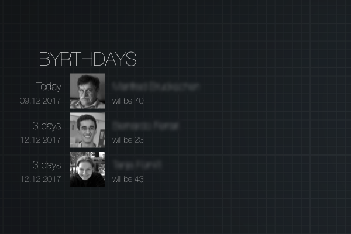

# byrthdays.widget

Widget for [Übersicht](http://tracesof.net/uebersicht/) to display upcoming birthdays on your macOS desktop.

## Installation
- Install [Übersicht](http://tracesof.net/uebersicht/) (if not already done)
- Download the [latest release](https://github.com/olfuerniss/byrthdays.widget/releases)
- Unzip the downloaded file
- Put the extracted folder 'byrthdays.widget' in your Übersicht widgets folder

## Info
Uses my command line tool 'byrthdays' ([GitHub link](https://github.com/olfuerniss/byrthdays)) to get the data from your contacts.

By default it shows birthdays within the next 14 days. The widget gets placed centered on the left side of your desktop. Feel free to adjust it. ;-)
